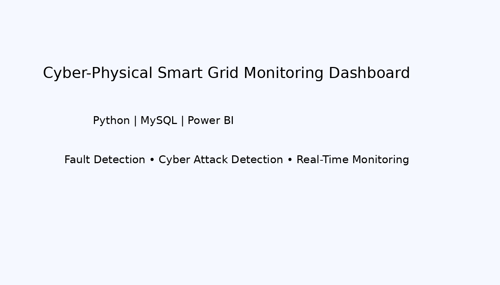
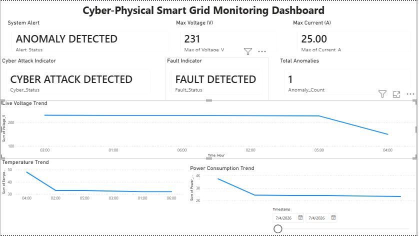
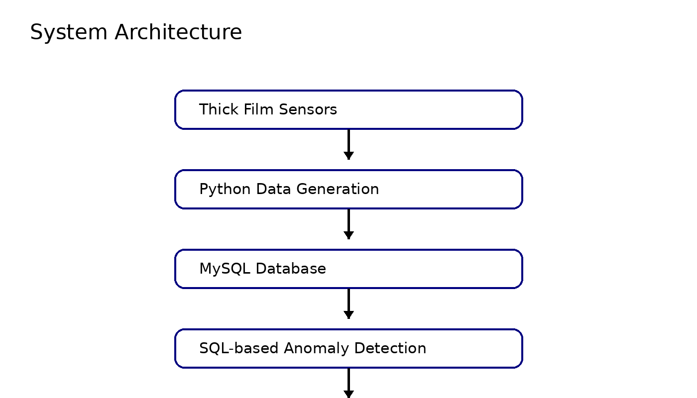
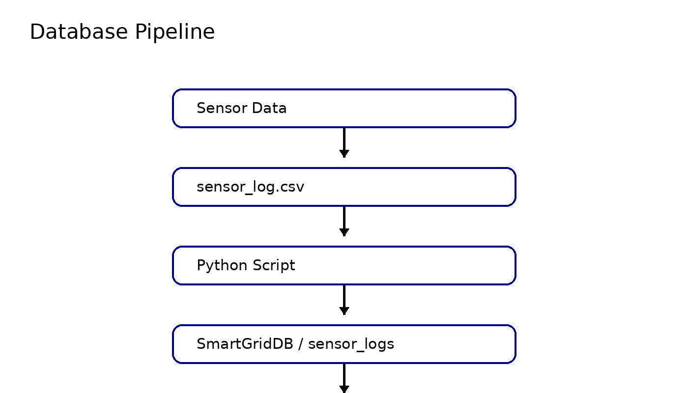
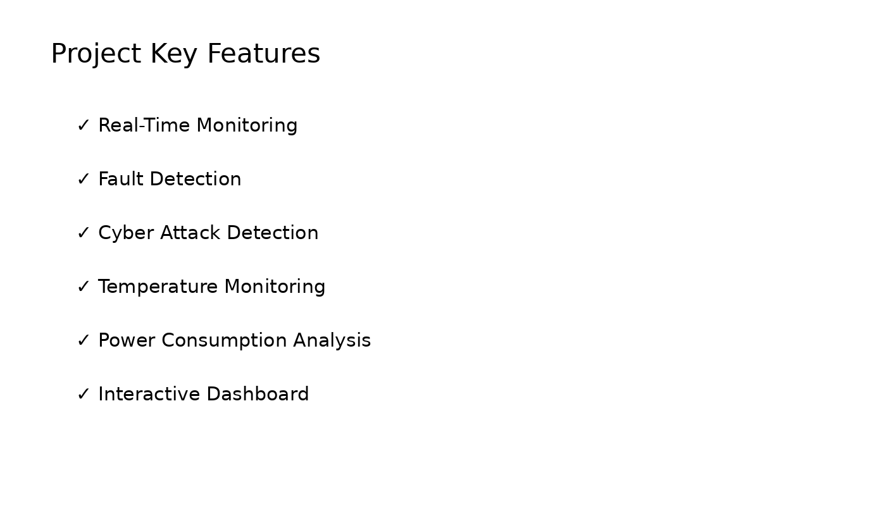

# Cyber-Physical Smart Grid Monitoring System

## 📌 Project Overview
This project presents a Cyber-Physical Smart Grid Monitoring System using Python, MySQL, and Power BI for anomaly detection and dashboard visualization.

## 🚀 Features
- Real-time sensor data monitoring
- Voltage and current anomaly detection
- Cyber attack indication
- Fault detection
- Interactive Power BI dashboard
- Data storage using MySQL

## 🛠️ Tech Stack
- Python
- MySQL
- Power BI
- Pandas
- Matplotlib

## 📂 Project Structure
```
Cyber-Physical-Smart-Grid-Monitoring-System
│
├── data
├── python
├── dashboard
├── screenshots
└── README.md
```

## 📊 Dashboard Features
- Live Voltage Trend
- Temperature Trend
- Power Consumption Trend
- System Alert Indicator
- Fault Indicator
- Cyber Attack Indicator
- Total Anomalies Counter


## 🖼️ Project Screenshots

### Project Cover


### Dashboard


### System Architecture


### Database Pipeline


### Features

## 👨‍💻 Author
Mohammad Isha  
B.Tech Electrical Engineering  
MMMUT Gorakhpur
